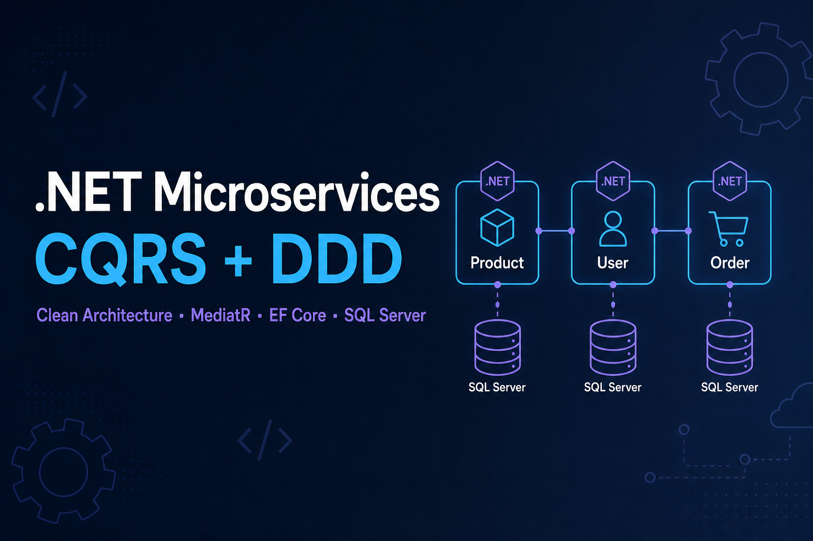

# CQRS + DDD Microservices Learning Project

> راهنمای آموزشی فارسی: [README-Order.html](README-Order.html) — در مرورگر باز کنید.

پروژه آموزشی **.NET 8** برای یادگیری **CQRS** و **DDD** با ساختار میکروسرویس، شامل سه سرویس مستقل: **Product**، **User**، **Order**.

## ویژگی‌ها

- معماری چهارلایه در هر سرویس (Domain / Application / Infrastructure / Api)
- جداسازی خواندن و نوشتن با **CQRS** و **MediatR**
- مفاهیم اصلی **DDD**: Aggregate Root، Entity، Value Object و Domain Events
- اعتبارسنجی تمیز با **FluentValidation** (Pipeline Behavior)
- پایداری داده با **EF Core** و **SQL Server** (دیتابیس مستقل برای هر سرویس)
- ارتباط بین سرویس‌ها با HTTP و الگوی وارونگی وابستگی
- اجرای کامل با **Docker Compose**

## پورت‌ها

| سرویس | Swagger |
|-------|---------|
| Product | http://localhost:5001/swagger |
| User | http://localhost:5002/swagger |
| Order | http://localhost:5003/swagger |

## اجرا

```bash
dotnet run --project src/Product/Product.Api
dotnet run --project src/User/User.Api
dotnet run --project src/Order/Order.Api
```

یا: `docker compose up --build`

## ساختار هر سرویس

```
*.Domain / *.Application / *.Infrastructure / *.Api
```

APIها با **Controller** پیاده‌سازی شده‌اند (نه Minimal API).

جزئیات کامل مفاهیم DDD و CQRS در [README-Order.html](README-Order.html) توضیح داده شده است.
